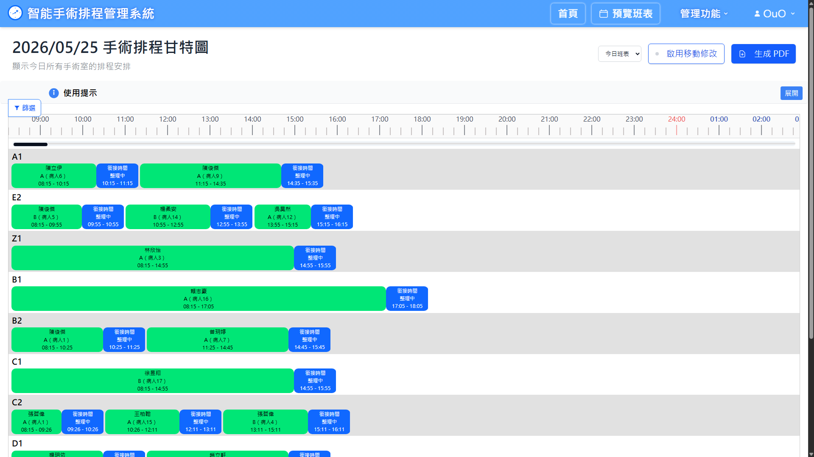
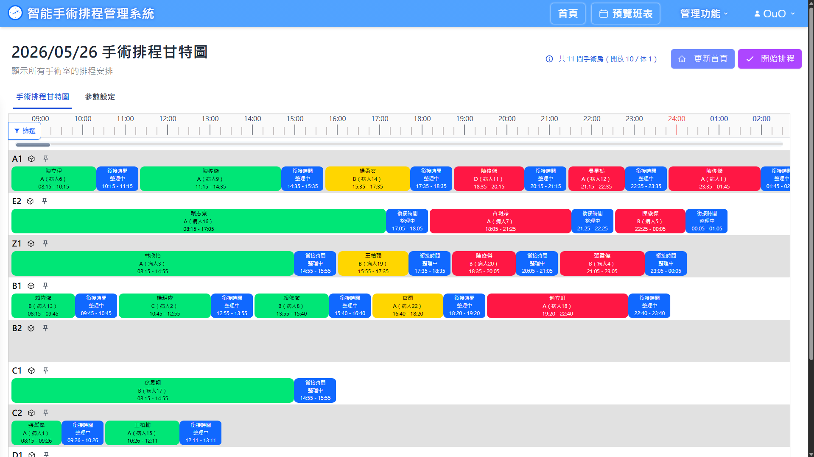
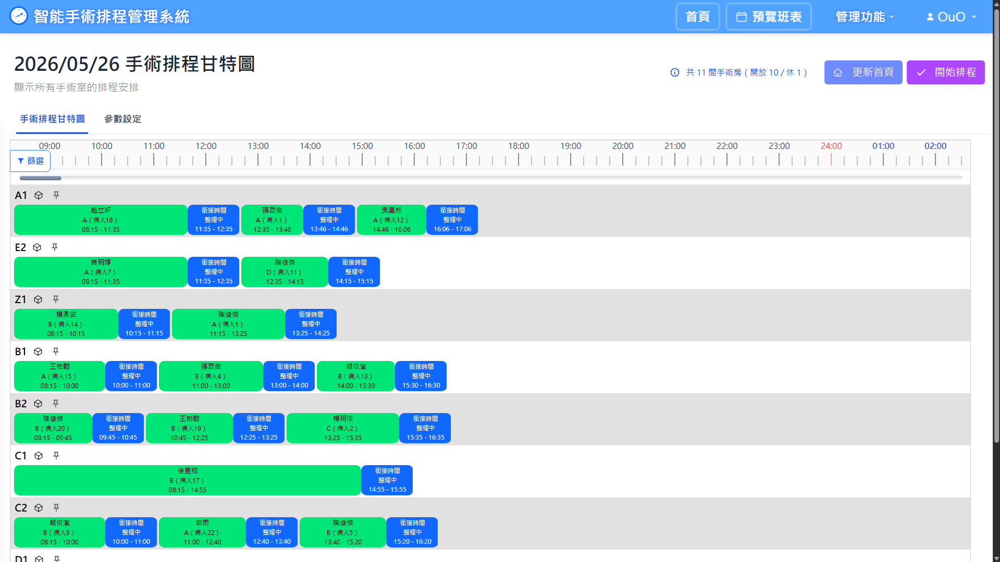
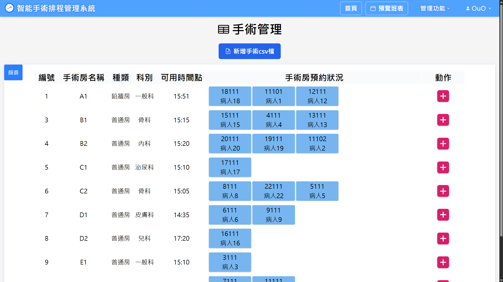
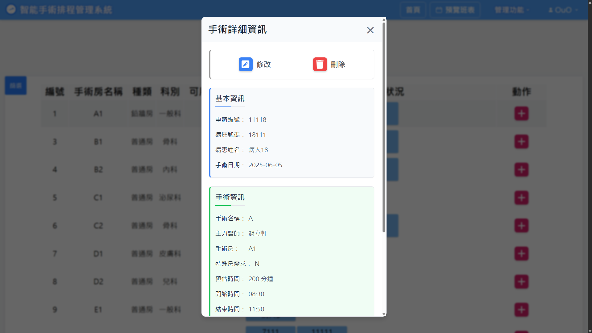
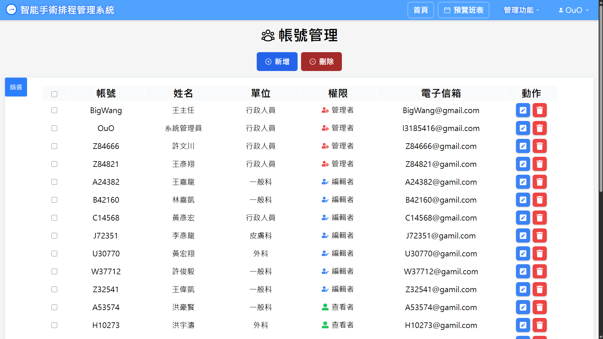
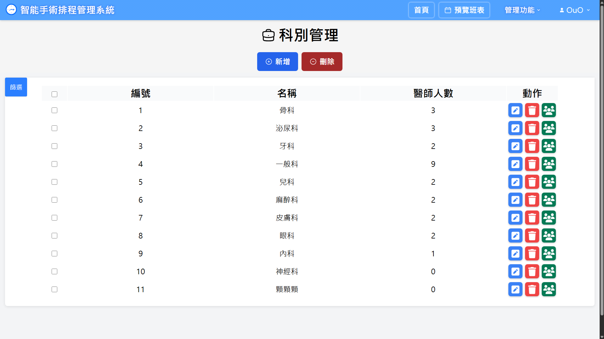
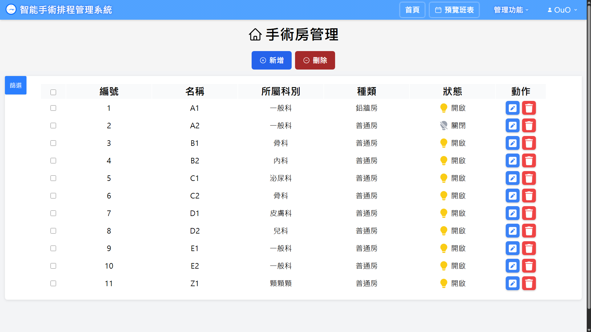

# 手術排程系統 Surgery Scheduling System

醫院手術室排程管理系統，結合模擬退火演算法（SA + SGDR）自動最佳化手術分配，並提供拖曳式甘特圖介面進行即時排程調整。

---

## 系統架構

```
React 前端 (Vite + TailwindCSS)
    ↓ axios REST API
Spring Boot 後端 (Java 22)
    ↓ JPA
MySQL 資料庫
    ↓ ProcessBuilder 子程序
SA 演算法 (獨立 Java 程式，CSV I/O)
```

---

## 系統需求

| 項目 | 版本 |
|------|------|
| Node.js | 18+ |
| Java | 22（後端）、8（ORSM 2025 演算法） |
| Maven | 3.8+ |
| MySQL | 8.0+ |

---

## 安裝與啟動

### 1. 資料庫設定

建立 MySQL 資料庫，並複製設定檔：

```bash
cp SERVER/server/src/main/resources/application.properties.template \
   SERVER/server/src/main/resources/application.properties
```

編輯 `application.properties`，填入資料庫名稱與密碼：

```properties
spring.datasource.url=jdbc:mysql://localhost:3306/你的資料庫名稱
spring.datasource.username=root
spring.datasource.password=你的密碼
```

> `application.properties` 已加入 `.gitignore`，不會被 commit。

### 2. 啟動後端

```bash
cd SERVER/server
mvn spring-boot:run
```

後端預設跑在 `http://localhost:8080`。

### 3. 啟動前端

```bash
npm install
npm run dev
```

前端預設跑在 `http://localhost:5173`。

### 4. 一鍵啟動（Windows）

```bash
start.bat
```

同時開啟後端與前端，各自在獨立的 cmd 視窗執行。

---

## 畫面截圖

### 甘特圖排程
手術以卡片形式排列於各手術房，可拖曳調整順序或跨房間移動。



### 演算法排程前後對比
點擊「執行演算法」後，系統自動重新分配所有手術。




### 手術管理
管理所有手術資料，支援新增、編輯、刪除與 CSV 批次匯入。



### 手術詳細資訊
點擊手術卡片可查看詳細資訊，並進行修改或刪除。



### 其他管理功能
同時提供管理帳號、科別、手術房資料之功能





---

## 使用說明

### 使用者角色

| 角色 | 權限 |
|------|------|
| 醫師（role=1） | 唯讀，檢視排程 |
| 管理員（role=2） | 管理手術、執行排程演算法 |
| 系統管理員（role=3） | 完整存取，含帳號／手術房／科別管理 |

### 主要功能

- **甘特圖排程**：拖曳手術卡片調整順序或跨房間移動
- **自動排程**：點擊「執行演算法」，系統以 SA 演算法最佳化所有手術分配
- **固定房間**：可鎖定特定手術房排程，演算法不會更動
- **手術群組**：多台手術可綁定為群組，一起移動／刪除
- **CSV 匯入**：批次上傳手術資料

---

## 演算法版本

系統內建三個演算法版本，目前使用 **Version 3（SA + SGDR）**。

| 版本 | 說明 | 位置 |
|------|------|------|
| V1 ORSM 2025 | 舊版，僅有 .class 檔 | `SERVER/server/ORSM 2025/` |
| V2 SurgerySchedulerSA | 簡單 SA | `SERVER/server/SurgerySchedulerSA/` |
| V3 Surgery-Scheduling-SA_SGDR | SA + SGDR 餘弦退火，現役 | `SERVER/server/Surgery-Scheduling-SA_SGDR/` |

切換版本：修改 `AlgorithmService.java` 中的三個常數（`BATCH_FILE_PATH`、`ORSM_FILE_PATH`、`ORSM_GUIDELINES_FILE_PATH`），並同步更新 `application.properties` 的 `time-table.export.path`。

### 單獨執行演算法（V3）

```bash
cd SERVER/server/Surgery-Scheduling-SA_SGDR
runScheduler.bat
```

SA 參數設定檔位於 `configs/SGDR_FOR.csv`。

---

## 專案結構

```
├── src/                        # React 前端
│   ├── components/
│   │   └── systemPage/main/
│   │       ├── Gantt/          # 甘特圖元件
│   │       ├── surgeryManagement/  # 手術管理
│   │       ├── shiftManagement/    # 班次管理
│   │       └── home/           # 首頁（今明兩日排程）
│   └── config.js               # API base URL 設定
│
└── SERVER/server/
    ├── src/main/java/com/backend/project/
    │   ├── Controller/         # REST API 控制器
    │   ├── Service/            # 業務邏輯（含演算法呼叫）
    │   ├── Dao/                # JPA Repository
    │   └── model/              # 資料模型
    ├── Surgery-Scheduling-SA_SGDR/  # 現役演算法（V3）
    ├── SurgerySchedulerSA/          # 演算法 V2
    └── ORSM 2025/                   # 演算法 V1（舊版）
```

---

## API 位址設定

編輯 `src/config.js`：

```js
// 本地開發
export const BASE_URL = import.meta.env.VITE_API_BASE_URL || "http://localhost:8080";

// 外部伺服器
// Set VITE_API_BASE_URL in your deploy environment for external access.
```
